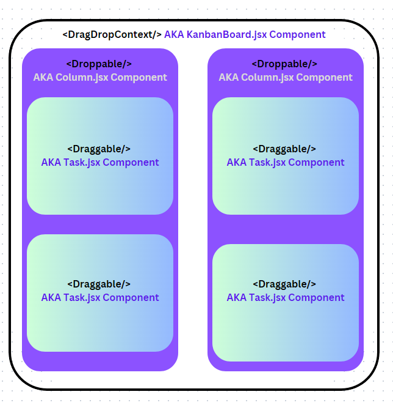

# Kanban Board

This Kanban board was created using React with Vite set up.
It also used react-beautiful and ant for some avatar animation.
Ensure after running 'npm install' that you have all the appropriate dependencies in package.json.

